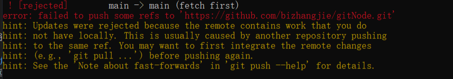

冲突是在使用版本控制系统（比如Git）进行合并操作时可能发生的一种情况。它通常发生在以下情况下：

1. **并行修改同一文件**：当多个开发者同时修改同一个文件，并尝试将其合并到同一个分支时，就可能会发生冲突。

2. **合并分支**：当你尝试将一个分支合并到另一个分支时，如果两个分支都对同一个文件进行了修改，Git会尝试自动合并，但有时会遇到冲突。

3. **拉取远程分支**：当你从远程仓库拉取代码时，如果你的本地分支与远程分支存在冲突，Git会通知你需要解决冲突。

4. **合并远程分支**：当你尝试将本地的更改推送到远程仓库，但远程仓库已经有其他人的更改，导致存在冲突。

冲突的原因是因为Git无法自动判断应该保留哪些更改，所以它需要你手动解决这些冲突。当冲突发生时，Git会在冲突的文件中标记出冲突的部分，类似于下面的示例：

```
<<<<<<< HEAD
这是本地的修改
=======
这是远程的修改
>>>>>>> branch_name
```

在这个示例中，`<<<<<<< HEAD`和`=======`之间是本地的修改，`=======`和`>>>>>>> branch_name`之间是远程的修改。解决冲突的过程就是手动编辑这些文件，选择保留哪些更改或进行其他修改，然后提交解决冲突后的文件。

解决冲突是开发中常见的任务之一，需要仔细审查代码，并确保在解决冲突后代码仍然正确工作。通常，团队成员之间需要进行沟通和协作，以确保正确解决冲突并保持代码库的健康。


除了手动解决冲突之外，Git还提供了一些命令方法来帮助你处理冲突。以下是一些常用的Git命令来解决冲突：

1. **查看冲突文件**：
```
git status
```
运行此命令后，Git会列出存在冲突的文件，你可以看到文件名以及哪些文件发生了冲突。

2. **查看冲突内容**：
```
git diff
```
这个命令可以显示冲突的具体内容。在冲突标记之间，你将看到本地版本和远程版本的差异。

3. **手动编辑解决冲突**：
打开冲突文件，编辑并选择保留需要的更改，删除不需要的标记，然后保存文件。

4. **标记冲突为已解决**：
编辑完冲突文件后，使用以下命令告诉Git冲突已经解决：
```
git add <文件名>
```
如果你解决了多个冲突文件，需要逐个使用`git add`命令标记这些文件为已解决。

5. **继续合并**：
在标记所有冲突文件为已解决后，使用以下命令完成合并过程：
```
git commit
```
这将提交合并后的结果，同时解决了冲突。

如果你遇到更复杂的冲突，可以考虑使用图形界面工具（如Git GUI或SourceTree）来帮助可视化解决冲突的过程。

总结来说，解决冲突的基本步骤是：查看冲突文件，手动编辑解决冲突，标记冲突为已解决，最后完成合并提交。冲突解决后，你的代码库就会包含所有正确合并的更改。

下面就是一个真实例子



这个错误提示是因为你尝试将本地分支推送到GitHub远程仓库时，远程仓库的状态与本地不一致，通常是因为其他人已经在远程仓库上提交了新的更改。为了避免覆盖其他人的更改，Git拒绝了你的推送。

解决这个问题的常见方法是先将远程仓库的更改拉取到本地，合并远程更改，然后再推送你的更改。以下是解决方法：

**步骤1：拉取远程更改**
在你的本地代码库中运行以下命令，拉取远程仓库的更改：
```
git pull origin main   # 或 master，具体取决于你的远程分支名称
```
上述命令将远程分支（如main或master）的更改合并到你的本地分支。

**步骤2：解决可能的冲突**
如果拉取远程更改时发生冲突，需要手动解决冲突。Git会在冲突的文件中标记出冲突的部分，你需要编辑文件并选择保留哪些更改或进行其他修改。完成解决冲突后，保存文件。

**步骤3：提交合并后的更改**
在解决冲突后，使用以下命令提交合并后的更改：
```
git add .   # 或指定解决冲突的文件
git commit -m "Merge remote changes"
```
这样你的本地分支就包含了远程仓库和你本地的更改。

**步骤4：推送到远程仓库**
现在你可以将你的本地更改推送到GitHub远程仓库：
```
git push origin main   # 或 master，具体取决于你的远程分支名称
```
如果之前解决冲突的步骤正确完成，你的推送应该不再遇到问题。

通过以上步骤，你应该能够解决这个推送被拒绝的问题，并将你的本地更改与远程仓库同步。在团队协作中，经常要处理类似的冲突情况，所以熟悉解决冲突的过程非常重要。